# Usecase 03 - Containerizing a flight booking app and deploying to Azure Kubernetes Service

**Objective**:

By the end of this module, you'll be able to:

- Containerize a Java app.

- Build a container image for the Java app.

- Run the container image locally.

- Push the container image to Azure Container Registry.

Deploy the container image to Azure Kubernetes Service

**Key technologies used** -- Java 11, Docker ,Maven

**Estimated duration**: 30 min

**Lab Type:** Instructor led


## Exercise 1 : Set up your Azure environment

In this exercise, you will use the Azure CLI to create the Azure resources that will be needed in later units. Using the Azure CLI,
perform the following steps

### Task 1: Run Docker

1.  On the Start menu/ from Desktop, double click on **DockerDesktop**

    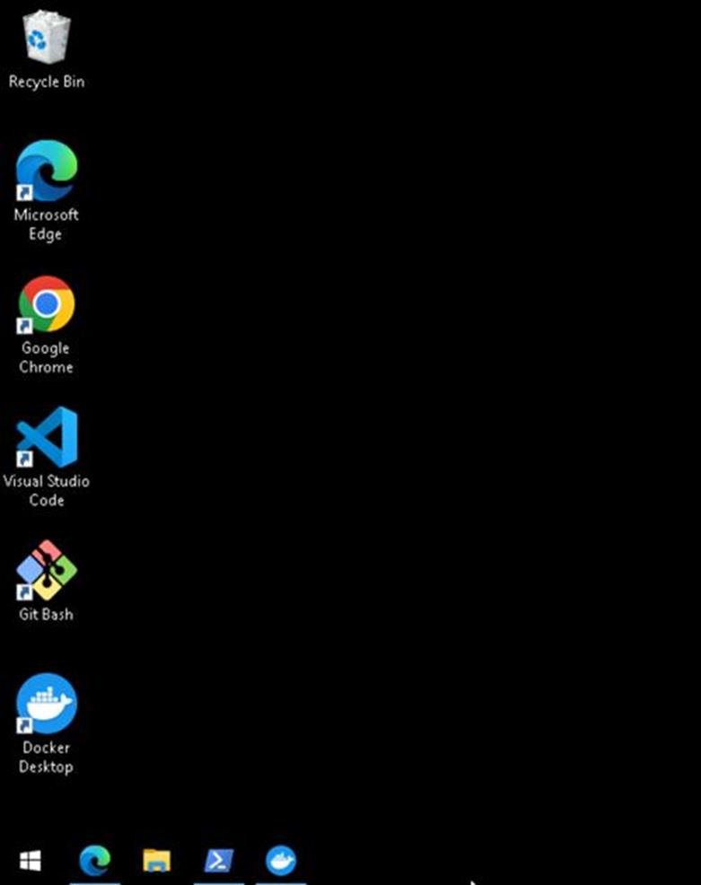

2.  Make sure it is running.

### Task 2: Authenticate with Azure Resource Manager

1.  Open Gitbash from the Desktop and run the below command login to the Azure     portal

    !!az login!!

    **Note**: If see WARNING: A web browser has been opened at https://login.microsoftonline.com/organizations/oauth2/v2.0/authorize.
    Please continue the log in to the web browser. If no web browser is available or if the web browser fails to open, use device code flow
    with az login --use-device-code

    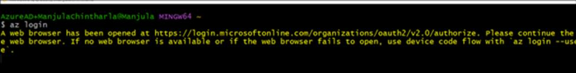

2.  This command will take you to the default browser to log in. Log in with your Azure subscription account.

    Username: !!@lab.CloudPortalCredential(User1).Username!!

    Password: !!@lab.CloudPortalCredential(User1).Password!!

    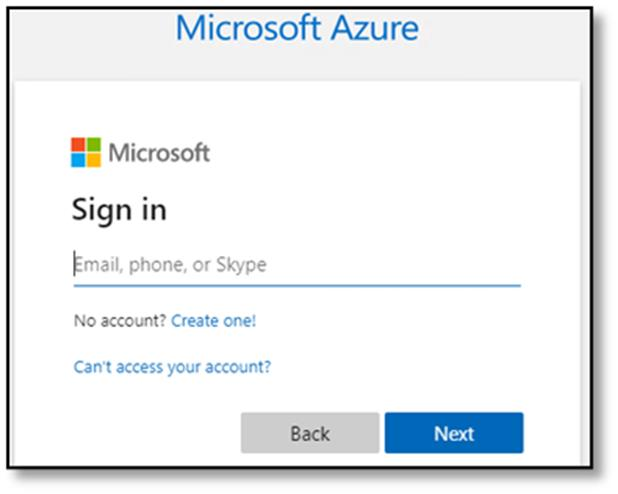

    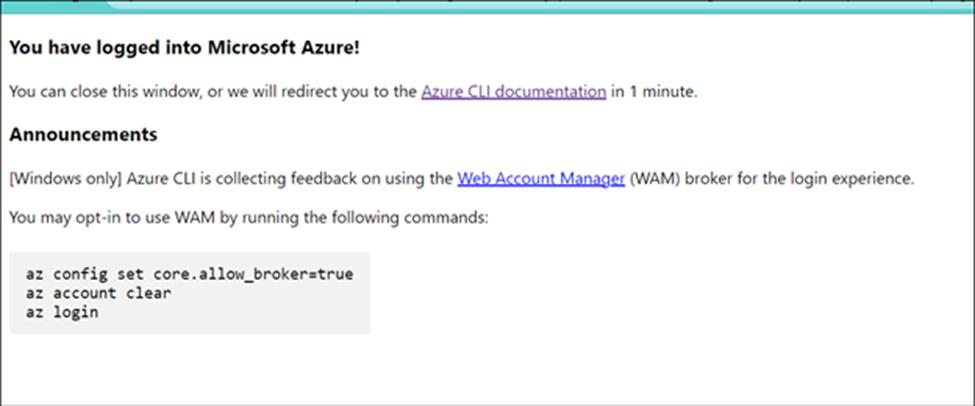

4.  Once authenticated switch back to the Gitbash

    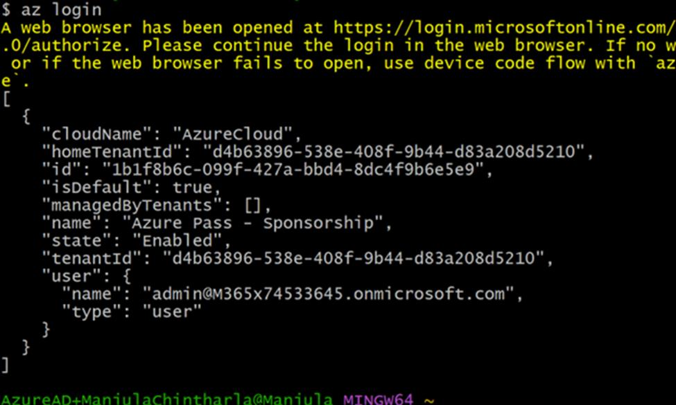

5.  Now we will enable our Azure subscription to execute the below command

    !!az account set --subscription @lab.CloudSubscription.Id!!

    !!az account list --output table!!  

    !!az provider register --namespace Microsoft.ContainerRegistry!!
     
    !!az provider register --namespace Microsoft.Compute!!
    
    !!az provider register --namespace Microsoft.CloudShell!!
    
    !!az provider register --namespace Microsoft.ContainerService!!

    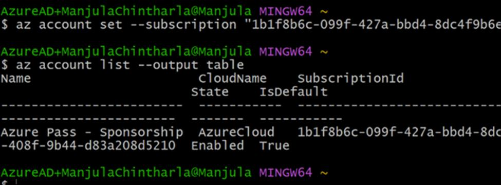

6.  Define local variables To simplify the commands that will be
    executed further down, set up the following environment variables

    >Note: We have already created ra esource group for me in the cloud. You have to deploy all resources within the existing resource group.     You can find it in your Azure portal or you can find it under the Resources tab on your VM

    !!export AZ_CONTAINER_REGISTRY=javaaksregist@lab.LabInstance.Id!!

    !!export AZ_KUBERNETES_CLUSTER=javaakscluster@lab.LabInstance.Id!!

    !!export AZ_LOCATION="westus"!!

    !!export AZ_KUBERNETES_CLUSTER_DNS_PREFIX="javaakscontainer"!!

    !!export AZ_RESOURCE_GROUP=@lab.CloudResourceGroup(ResourceGroup1).Name!!

    >**Note:** You'll want to replace with your region of choice, for example: eastus You'll want to replace with a unique value as this is
    used to generate a unique FQDN (fully qualified domain name) for your Azure Container Registry when it is created, for example:
    someuniquevaluejavacontainerregistry.

    

8.  Azure Container Registry allows you to build, store, and manage container images, which are ultimately where the container image for
    the Java app will be stored. Create an Azure Container Registry with the following commands.

    !!az acr create --resource-group $AZ_RESOURCE_GROUP --name $AZ_CONTAINER_REGISTRY --sku Basic | jq!!

    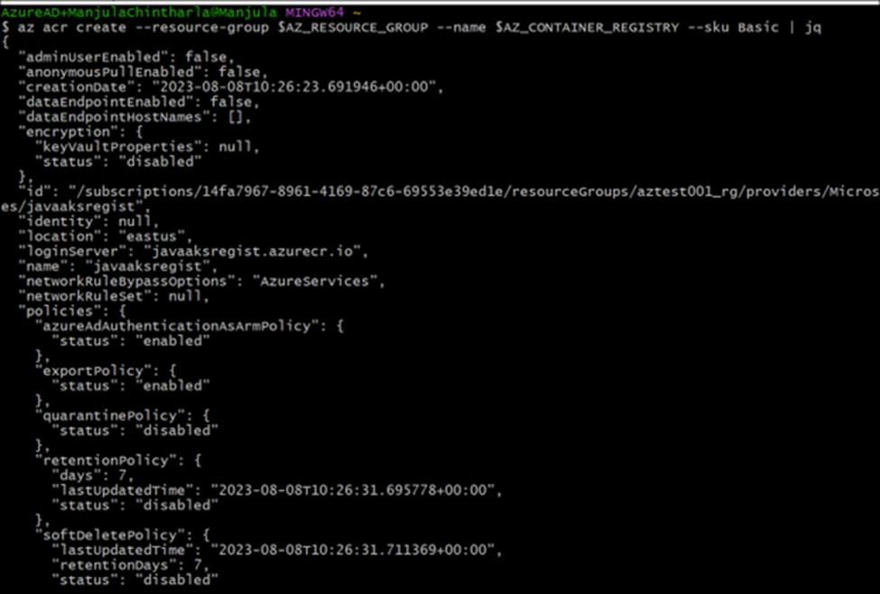

9.  Configure Azure CLI to use this newly created Azure Container Registry

    !!az configure --defaults acr=$AZ_CONTAINER_REGISTRY!!

    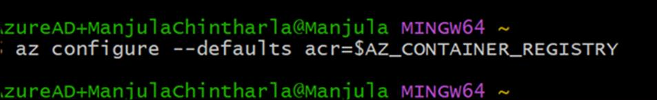

10. Authenticate to the newly created Azure Container Registry

    !!az acr login -n $AZ_CONTAINER_REGISTRY!!

    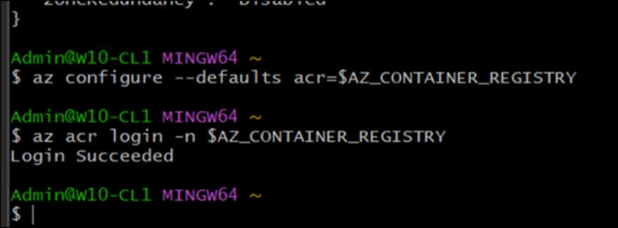

11. Create an Azure Kubernetes Cluster, You'll need an Azure Kubernetes Cluster to deploy the Java app (container image) to.

    !!az aks create --resource-group $AZ_RESOURCE_GROUP --name $AZ_KUBERNETES_CLUSTER --attach-acr $AZ_CONTAINER_REGISTRY --dns-name-prefix=$AZ_KUBERNETES_CLUSTER_DNS_PREFIX --generate-ssh-keys | jq!!

    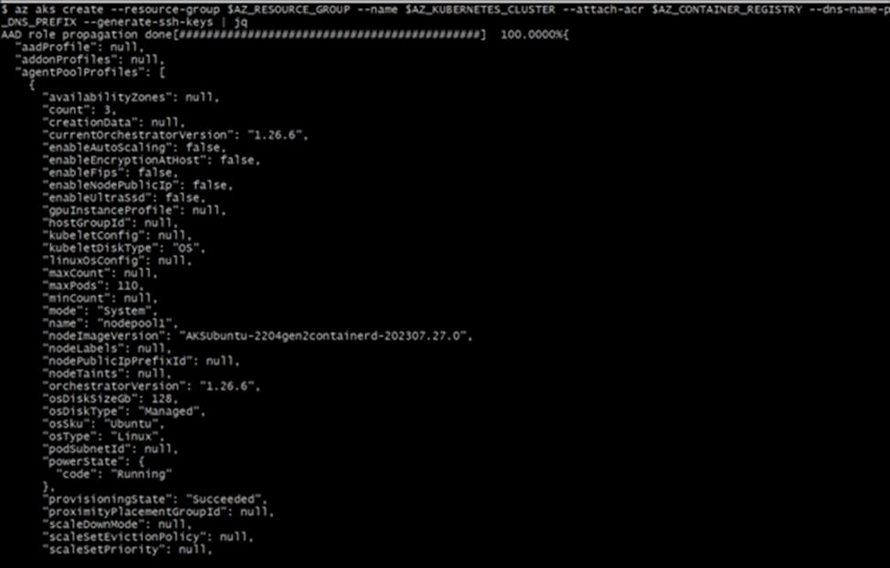

>**Note:** Azure Kubernetes Cluster creation can take up to 10 minutes, once you run the command above, you can optionally let it continue in
that Azure CLI tab and move on to the next unit.


## Exercise 2: Containerize a Java app

In this exercise, you will containerize a Java application.

### Task 1: Build Java Application

First, you will navigate the Flight Booking System for Airline Reservations repository and cd to the Airlines web application project
folder.

Optionally, if you have Java & Maven installed, you can run the following command(s) in your CLI to get an sense of the experience in
building the application without Docker. If you do not have Java & Maven installed, you can safely jump ahead to the next section titled
"Construct a Docker file", In that section you'll use Docker to pull down Java and Maven to execute the builds on your behalf.

1.  Run the following command in your CLI to navigate to the project.

    !!cd "C:\Labfiles\containerize-and-deploy-Java-app-to-Azure-master\Project\Airlines"!!

    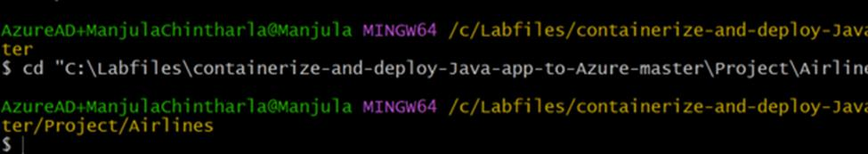

2.  Run the following command in your CLI

    !!mvn clean install!!

    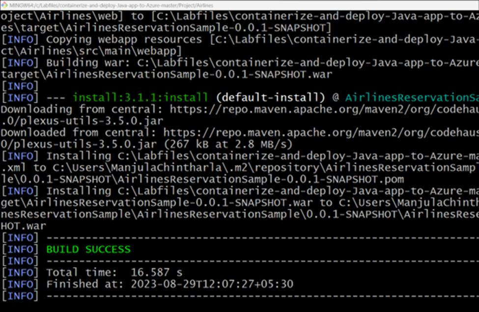

    >**Note:** The mvn clean install command was used to illustrate the operational challenges of not using Docker multi-stage builds, that we
    will cover next. Again this step is optional, either way, you can safely move along without executing the Maven command.

3.  Maven should have successfully built the Flight Booking System for Airline Reservations Web Application Archive artifact
    FlightBookingSystemSample-0.0.-SNAPSHOT.war, as seen in the following image

    

## Task 2: Construct a Docker file

1.  Within the root of your project, containerize-and-deploy-Java-app-to-Azure/Project/Airlines, Create a file called **Dockerfile.**

    !!vi Dockerfile!!

    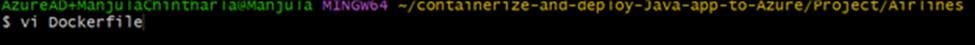

    Add the following contents to Dockerfile and then save and exit

```
#
# Build stage
#
FROM maven:3.6.0-jdk-11-slim AS build
WORKDIR /build
COPY pom.xml .
COPY src ./src
COPY web ./web
RUN mvn clean package

#
# Package stage
#
FROM tomcat:8.5.72-jre11-openjdk-slim
COPY tomcat-users.xml /usr/local/tomcat/conf
COPY --from=build /build/target/*.war /usr/local/tomcat/webapps/FlightBookingSystemSample.war
EXPOSE 8080
CMD ["catalina.sh", "run"]
```

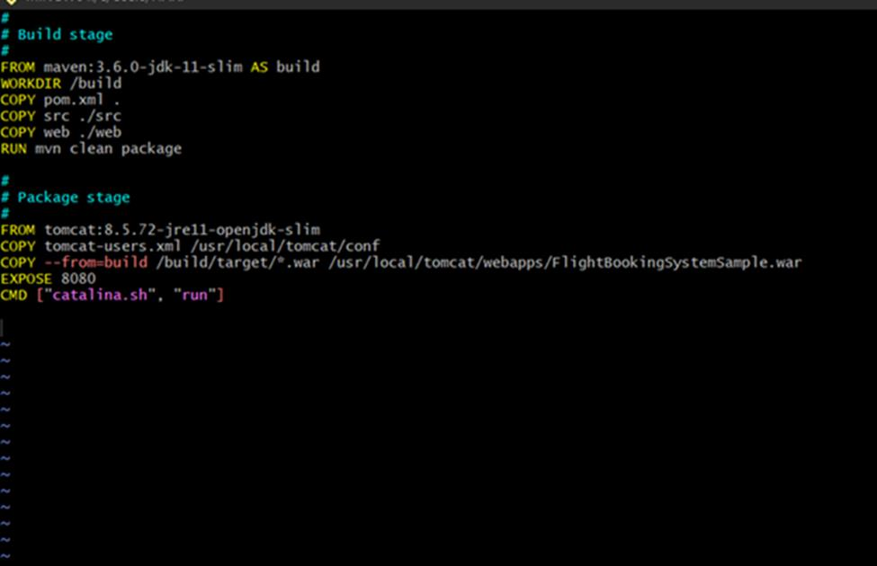

>**Note:** Optionally, the Dockerfile_Solution at the root of your project contains the needed content.As you can see, this Docker file
The build stage has six instructions.

## Exercise 3: Build and run a container image for the Java app

In this unit, you will build and run the container image. As mentioned earlier, a running instance of an image is a container.

### Task 1: Build a container image

Now that you've successfully constructed a Dockerfile, you can instruct Docker to build a container image for you.

>**Note:** Ensure your Docker runtime is configured to build Linux containers. This is important as the Dockerfile being used references
container images (JDK/JRE) for the Linux architecture.

1.  **Docker build** is the command used to build container images.The **-t** argument will be used to specify a container label and
    the **.** is the location for Docker to find the Dockerfile. Run the following command in your CLI.

    **IMPORTANT**: This lab requires jdk 11 . set java_home to jdk 11

    !!docker build -t flightbookingsystemsample .!!

    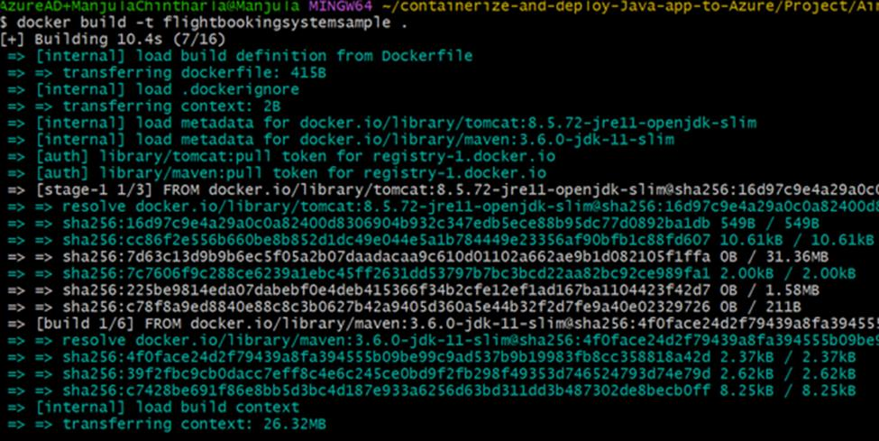

2.  Docker build is something similar

    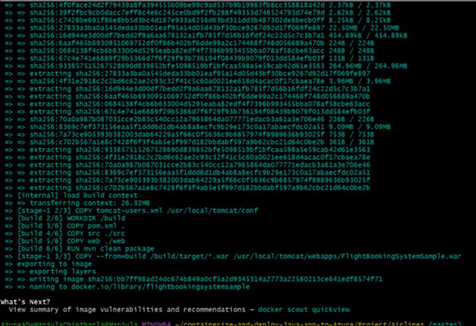

    >**Note:** As you saw previously, Docker has executed the instructions from the lines that you've previously written in the prior unit.       Each instruction is a step in sequential order. Rerun the docker build command again, notice the differences in the steps, you'll notice 
    Using cache for layers that haven't changed. If your not making app changes (before rerunning the docker build command), then you'll          notice all cached layers as the binaries are untouched and can be sourced from Docker cache). This is an important takeaway when              optimizing your container images and the associated compute costs with time spent building them.

3.  Docker can also display the available images that are resident. This is helpful for viewing what's available to run. Run the following
    command in your CLI

    !!docker image ls!!

    You will see something similar:

    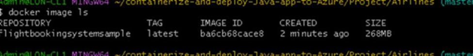

### Task 2: Run a container image

1.  Go to Start and search for !!command prompt!! and open it as Administrator. run below command and check if any process is running on port 8080.
 !!netstat -ano | findstr :8080!!

2.  Run the below command with process id running on port 8080
   
    !!taskkill /PID XXXX /F!! (replace XXXX with your process ID

3.  You can run a container image now that you have successfully built it.

4.  Docker run is the command used to run a container image. The -p :#### argument will be used to forward localhost HTTP (the first port before the colon) traffic to the container at runtime (the second port after the colon). Remember from the Dockerfile that the Tomcat appserver is listening for HTTP traffic on port 8080 hence that is the container port that needs to be exposed. Lastly the image tag flightbookingsystemsample is needed to instruct Docker of what image to run. Run the following command in your CLI:

    !!docker run -p 8080:8080 flightbookingsystemsample!!

   You'll see something similar:

    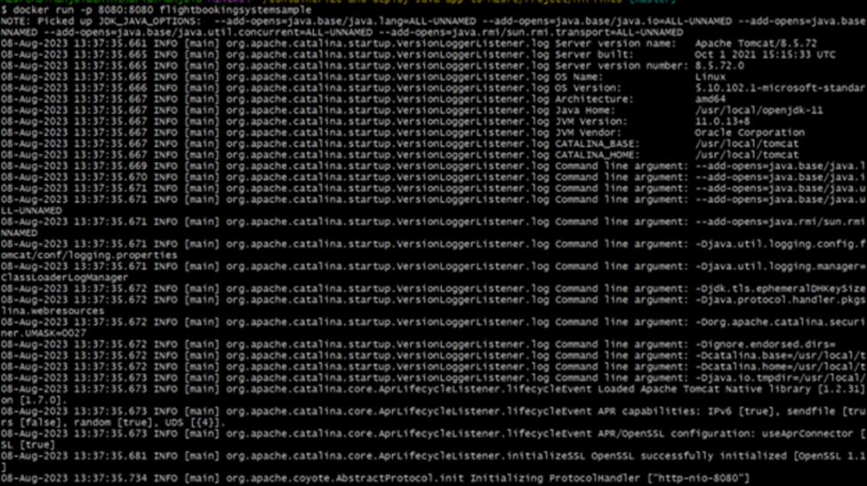

    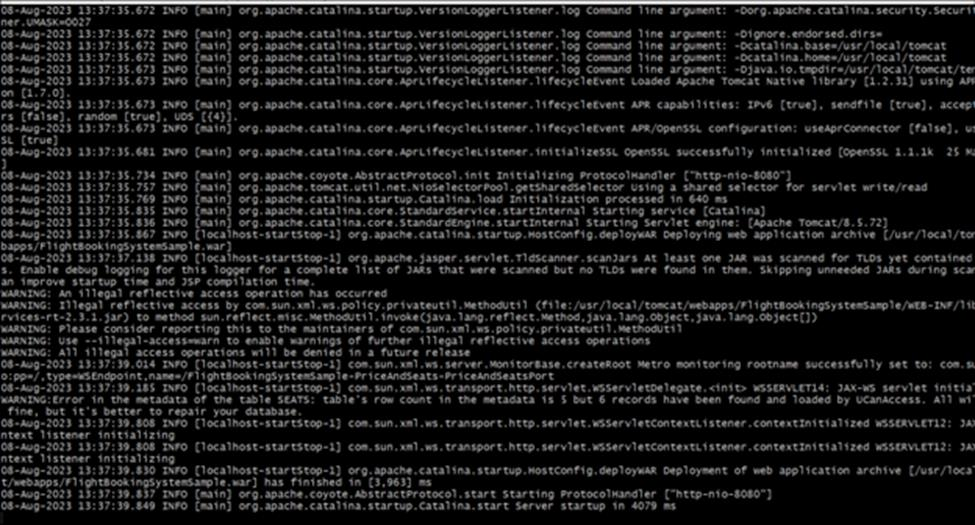

    >**Note:** if the command "docker run -p 8080:8080 flightbookingsystemsample" comes up with an error, then use the below
    mentioned port

    !!docker run -p 8081:8080 flightbookingsystemsample!!

5.  Open up a browser and visit the Flight Booking System for Airline Reservations landing page  
    at  !!http://localhost:8080/FlightBookingSystemSample!!

   You should see the following:

    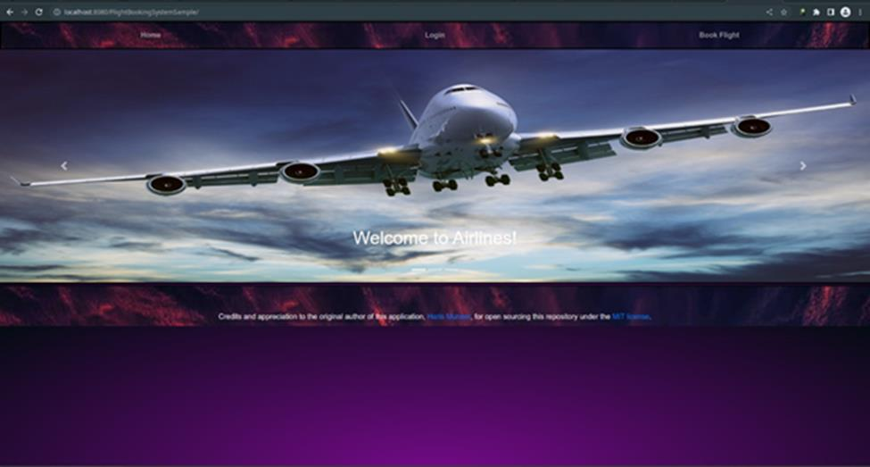

6.  You can optionally sign in with any user from tomcat-users.xml for example

    Username:  !!someuser@azure.com!!

    Password: !!password!!

    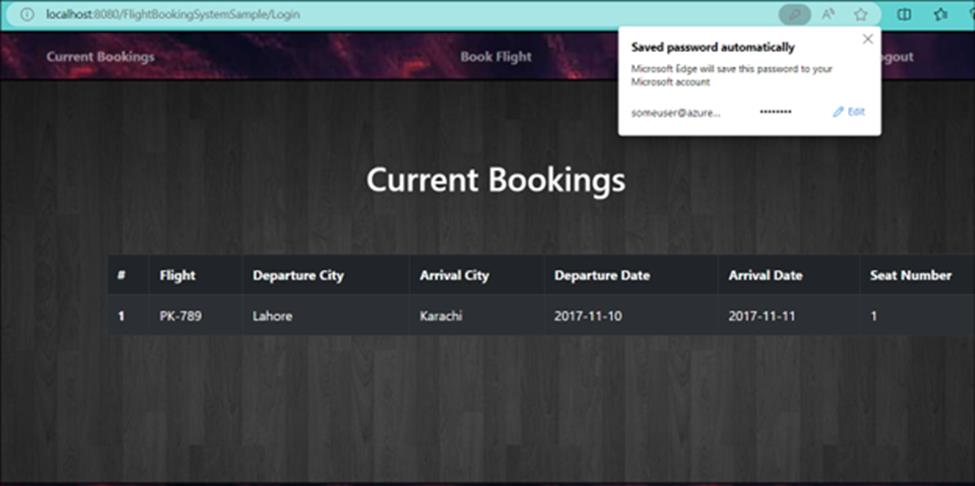

7.  Leave this Git bash instance without closing it.

## Exercise 4: Push the container image to Azure Container Registry

### Task 1: push a container image to Azure Container Registry

1.  In this task, you will push a container image to Azure Container Registry.Azure Container Registry allows you to build, store, and
    manage container images and artifacts in a private registry for all types of container deployments. Use Azure container registries with
    your existing container development and deployment pipelines.

2.  Open a new instance of Gitbash and run az command to sign into the Azure portal.

    !!az login!!

3.  Run the following command in your CLI

    !!cd "C:\Labfiles\containerize-and-deploy-Java-app-to-Azure-master\Project\Airlines"!!

4.  We will be using the same Authenticate with Azure Resource Manager we created earlier in Exercise 1 Task 1. Set the below variables as per your variable values in the Azure portal.

!!export AZ_RESOURCE_GROUP=@lab.CloudResourceGroup(ResourceGroup1).Name!!

!!export AZ_CONTAINER_REGISTRY=javaaksregist@lab.LabInstance.Id!!

!!export AZ_KUBERNETES_CLUSTER=javaakscluster@lab.LabInstance.Id!!

!!export AZ_LOCATION=“westus”!!

!!export AZ_KUBERNETES_CLUSTER_DNS_PREFIX="javaakscontainer"!!

> **Note:** If your session has idled out, you are doing this step at another point in time and/or from another CLI you may have to re
> Initialize your environment variables and re-authenticate with the following CLI commands.

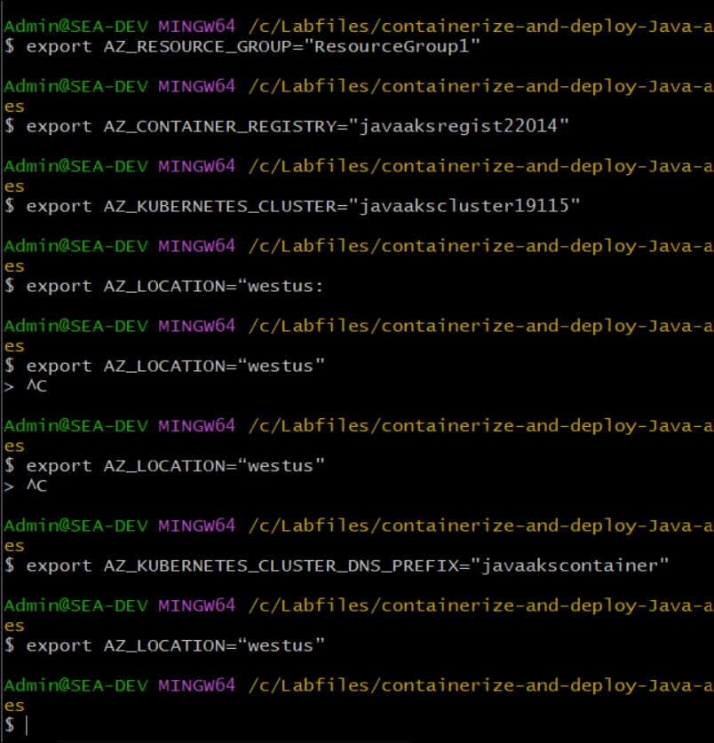

### Task 2: Push a container image

In this task You can push your newly built container image to the Azure Container Registry. By doing so, your container image will be network
close to all of your Azure resources, such as your Azure Kubernetes Cluster. You'll ultimately configure AKS to pull the
flightbookingsystemsample image from Azure Container Registry.

1.  To push the container image to Azure Container Registry, run the following three commands in your CLI

2.  Sign in **Azure Container Registry** execute the below command

    !!az acr login -n $AZ_CONTAINER_REGISTRY!!

    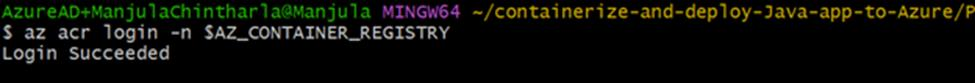

3.  First tag the previously built container image with your Azure Container Registry:

    !!docker tag flightbookingsystemsample $AZ_CONTAINER_REGISTRY.azurecr.io/flightbookingsystemsample!!

    

4.  Second, push the container image to Azure Container Registry

    !!docker push $AZ_CONTAINER_REGISTRY.azurecr.io/flightbookingsystemsample!!

    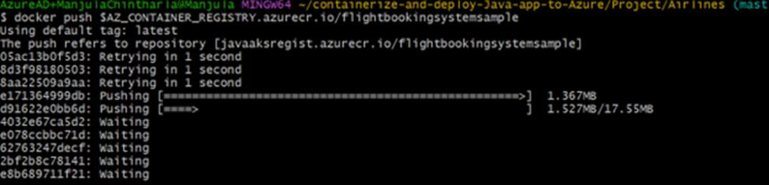

    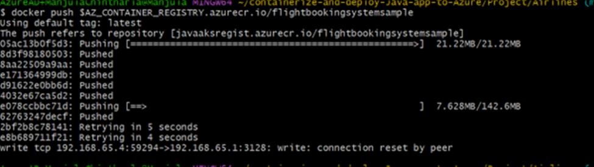

5.  Now view the Azure Container Registry image meta-data of the newly pushed image. Run the following command in your CLI

    !!az acr repository show -n $AZ_CONTAINER_REGISTRY --image flightbookingsystemsample:latest!!

    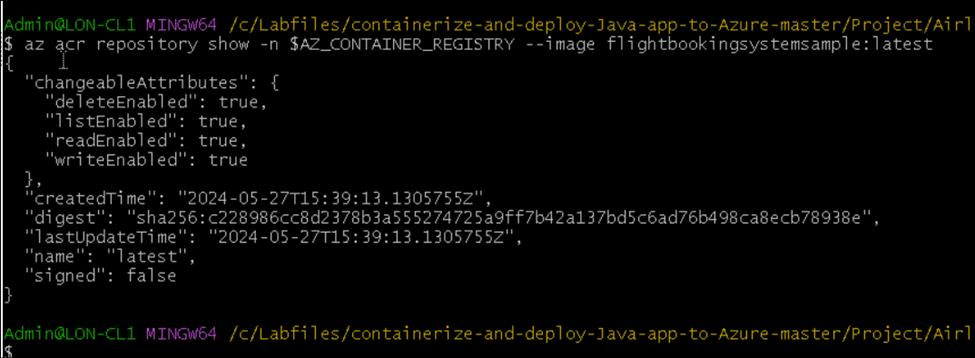

6.  Container image is now resident within Azure Container Registry and ready for deployments by Azure Services such as Azure Kubernetes
    Service.

## Exercise 5: Deploy the container image to Azure Kubernetes Service

In this exercise, you will deploy a container image to Azure Kubernetes Service.

### Task 1: Deploy a container image

1.  You will deploy the **flightbookingsystemsample** container image to your Azure Kubernetes Cluster.

2.  Within the root of your project, **Flight-Booking-System-JavaServlets_App/Project/Airlines**,Create a file called deployment.yml. Run the following command in your CLI:

   AZ_CONTAINER_REGISTRY=!!javaaksregist@lab.LabInstance.Id!!

    !!vi deployment.yml!!

    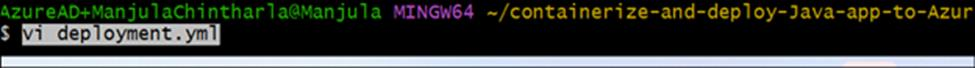

4.  Add the following contents to deployment.yml and then save and exit:

    >**Note:** You'll want to update with your AZ_CONTAINER_REGISTRY environment variable value that was set earlier, Exercise 1 Task1( AZ_CONTAINER_REGISTRY= javaaksregist )-   AZ_CONTAINER_REGISTRY=!!avaaksregist@lab.LabInstance.Id!!
   

```
apiVersion: apps/v1
kind: Deployment
metadata:
  name: flightbookingsystemsample
spec:
  replicas: 1
  selector:
    matchLabels:
      app: flightbookingsystemsample
  template:
    metadata:
      labels:
        app: flightbookingsystemsample
    spec:
      containers:
      - name: flightbookingsystemsample
        image: <AZ_CONTAINER_REGISTRY>.azurecr.io/flightbookingsystemsample:latest
        resources:
          requests:
            cpu: "1"
            memory: "1Gi"
          limits:
            cpu: "2"
            memory: "2Gi"
        ports:
        - containerPort: 8080
---
apiVersion: v1
kind: Service
metadata:
  name: flightbookingsystemsample
spec:
  type: LoadBalancer
  ports:
  - port: 8080
    targetPort: 8080
  selector:
    app: flightbookingsystemsample
 ```
    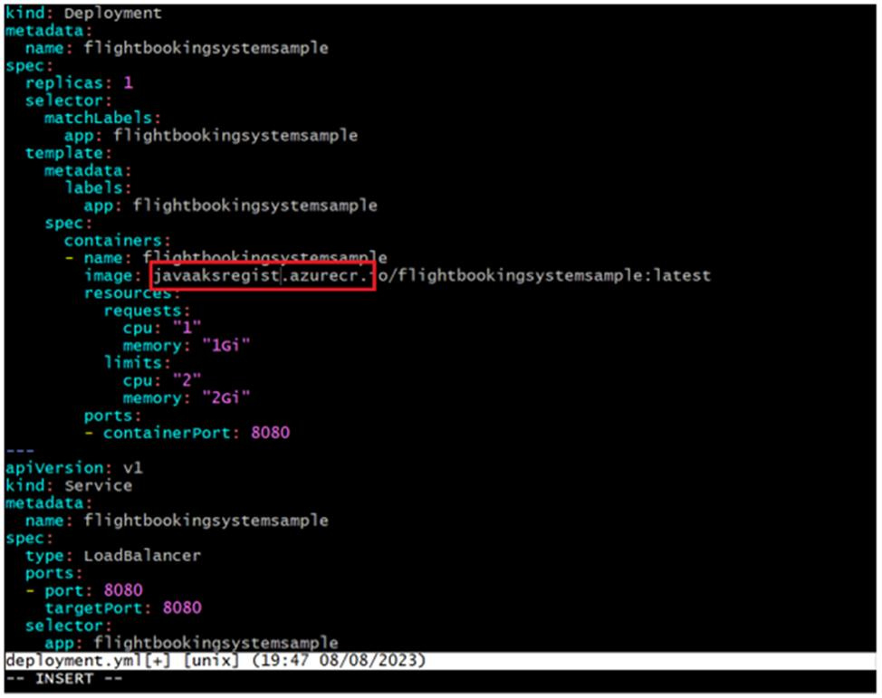

5.  Press Esc and: and then type +++wq+++ and press enter to save the file.

    >**Note:** Optionally, the deployment_solution.yml in the root of your project contains the contents needed, you may find it easier to
    rename/update the contents of that file.

6.  In the deployment.yml above you'll notice this deployment.yml contains a Deployment and a Service. The deployment is used to
    administer a set of pods while the service is used to allow network access to the pods. You'll notice the pods are configured to pull a
    single image, the \< AZ_CONTAINER_REGISTRY \>.azurecr.io/flightbookingsystemsample:latest from Azure Container
    Registry. You'll also notice the service is configured to allow incoming HTTP pod traffic to port 8080, similarly to the way you ran
    the container image locally with the -p port argument.

7.  By now your Azure Kubernetes Cluster creation should have completed.

8.  Now configure your Azure CLI to access your Azure Kubernetes Cluster via the kubectl command. Install kubectl locally using the az aks
    install-cli command. Run the following command in your CLI

    !!az aks install-cli!!

    

9.  Configure kubectl to connect to your Kubernetes cluster using the az aks get-credentials command. Run the following command in your CLI

    !!az aks get-credentials --resource-group $AZ_RESOURCE_GROUP --name $AZ_KUBERNETES_CLUSTER!!

    

10.  Now instruct Azure Kubernetes Service to apply deployment.yml changes to your cluster. Run the following command in your CLI

    !!kubectl apply -f deployment.yml!!

   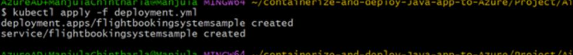

10. Now use **kubectl** to monitor the status of the deployment. Run the following command in your CLI

    !!kubectl get all!!

    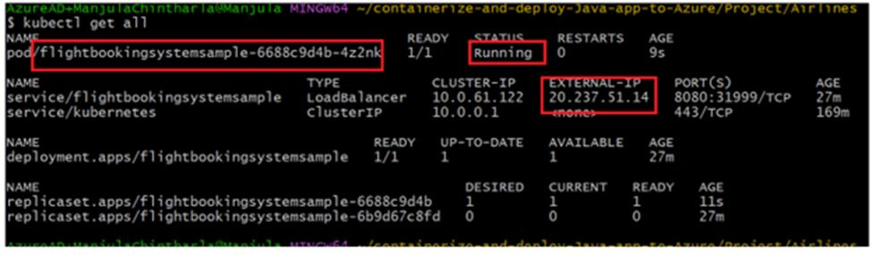

    >**Note:** You'll want to substitute the ip address in the following,20.81.13.151, with that of your EXTERNAL-IP and note down the POD         name,we will be using that in the next steps.

11. If your **POD** status is **Running** then the app should be accessible.

12. You can view the app logs within each pod as well.Replace XXXX with your POD at the end of the command and run it in CLI as shown in the below image.  (eg - **kubectl logs pod/flightbookingsystemsample-6688c9d4b-4z2nk**)

    !!kubectl logs pod/flightbookingsystemsample-!!

    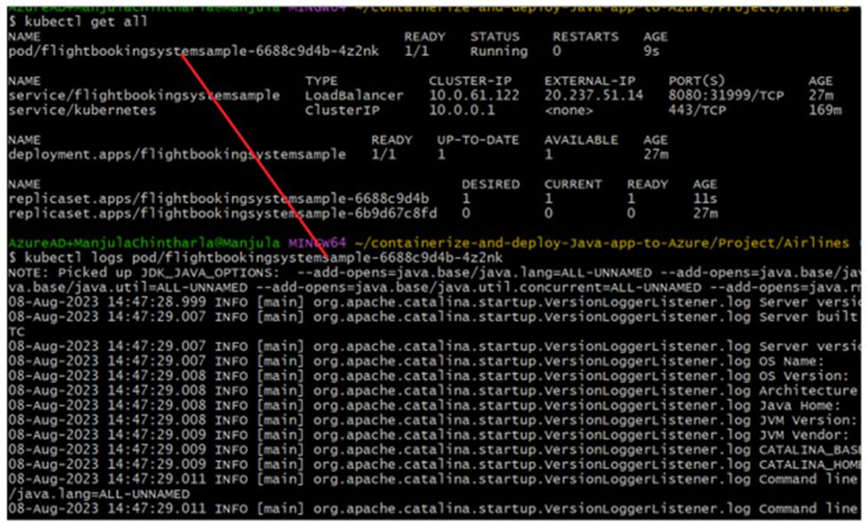

    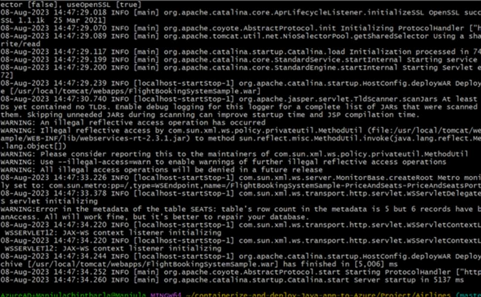

13. Now use the **EXTERNAL-IP** from your kubectl get services flightbookingsystemsample output to access the running app within
    Azure Kubernetes Service.

    >**Note:** You'll want to substitute the ip address in the following,20.81.13.151, with that of your EXTERNAL-IP from the command you
    previously executed.

14. Open up a browser and visit the Flight Booking System Sample landing page at   !!http://YOUR IPCON:8080/FlightBookingSystemSample!! (update with your external IP address )

   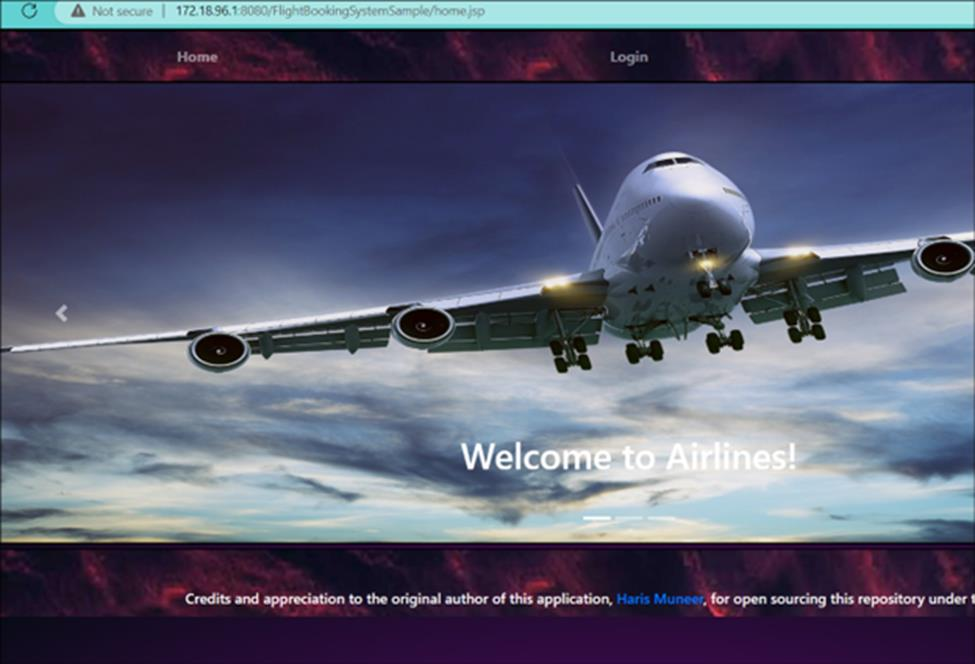

    >**Note:** You can optionally sign in with any user from tomcat-users.xml for example someuser@azure.com: password

### Task 2 : Clean Up Resources

1.  Switch back to the Azure portal. Click on **Resource groups**.

    

2.  Click on the resource group name.

    

3.  Select all resources and then click on **Delete** (Do NOT DELETE – Resource group)

4.  Enter !!delete!! and then click on **Delete**.

    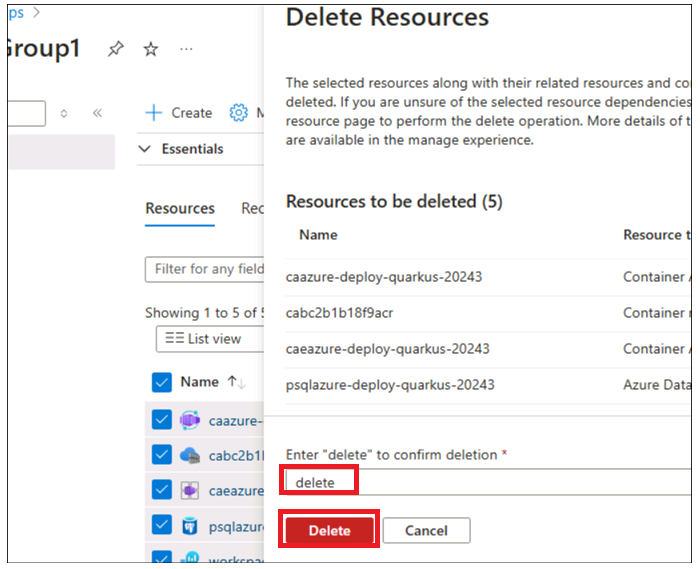

5.  Confirm deletion of resources.

    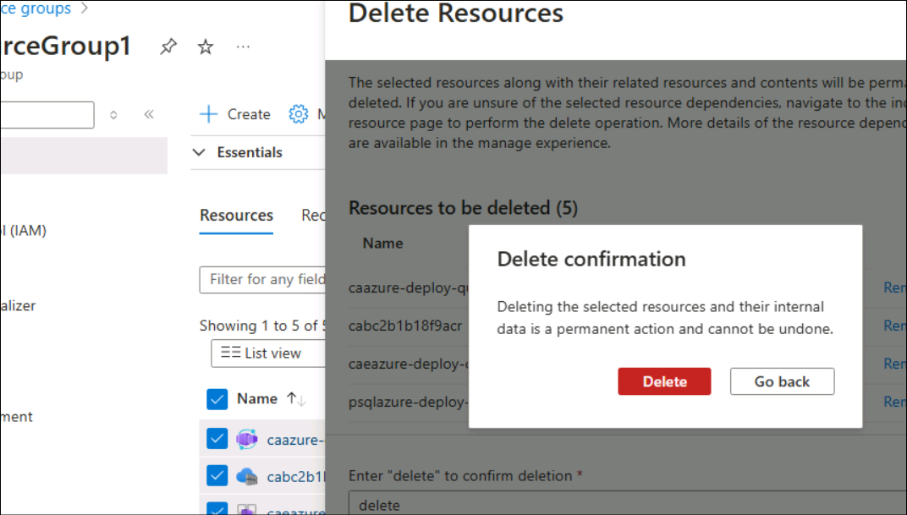

>**Summary:** Congratulations! We have containerized and deployed a Java app to Azure Kubernetes Service. As part of the lab we containerized a Java app, push the container image to Azure Container Registry, and then deploy to Azure Kubernetes Service.
